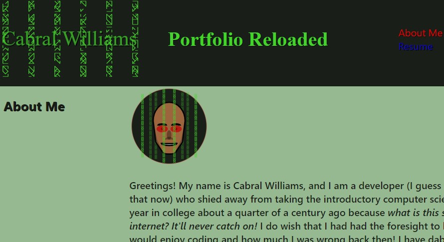

# Portfolio Reloaded

  

  

  ## Description
  This project is a revamping of an earlier programming portfolio project.  This project incorporates React, among other programming standards.
  
  ## Link
  [Portfolio Reloaded](https://cabralwilliams.github.io/portfolio-reloaded/)
  
  ## Table of Contents
  
  * [Installation](#installation)
  * [Usage](#usage)
  * [License](#license)
  * [Contributing](#contributing)
  * [Tests](#tests)
  * [Questions](#questions)
  
  ## Installation
  
  This project was modified from the basic create-react-app starting point.  If you wish to create a similar portfolio using React, with node.js installed on your machine, type 'npx create-react-app' in the directory of your choice.
  
  ## Usage
  
  This project is just for demonstration and informational purposes.  There is no true 'usage' of the project.
  
  ## License
  
  The content of this project is licensed under the [MIT License](https://opensource.org/licenses/MIT).  Please click [here](https://opensource.org/licenses/MIT) for more information about how you may use code in this project.

  ## Contributing

  I will likely be making adjustments on this project individually as time goes on.  As this is an individual portfolio project, I will likely not be having other people actively contributing.
  
  
  ## Tests
  
  There was no specific testing that went into creating this project other than basic trial an error with the various react components.
  
  ## Questions
  [GitHub Profile](http://github.com/cabralwilliams)
  
  For any questions concerning this application, please contact me at cabral.williams@gmail.com.